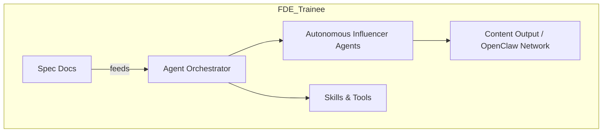

# Project Chimera 🏗️

**Role:** Forward Deployed Engineer (FDE) Trainee  
**Mission:** Architect the "Factory" that builds the Autonomous Influencer  
**Status:** Spec-Driven, Agentic Infrastructure, MCP-Connected  

---

## Table of Contents

- [Overview](#overview)  
- [Project Goals](#project-goals)  
- [Architecture & Patterns](#architecture--patterns)  
- [Specs](#specs)  
- [Skills](#skills)  
- [Testing Strategy](#testing-strategy)  
- [Tooling & MCP Integration](#tooling--mcp-integration)  
- [CI/CD & Governance](#cicd--governance)  
- [Contribution Guidelines](#contribution-guidelines)  
- [License](#license)  

---

## Overview

Project Chimera is an **autonomous AI influencer system** designed to research trends, generate content, and manage engagement with minimal human intervention.  

This repository is **architecture-first**, following Spec-Driven Development (SDD) principles. All AI agents, scripts, and skills operate under **traceable specifications**, enforced through Tenx MCP Sense telemetry.

---

## Project Goals

1. **Spec Fidelity:** Ensure every feature is fully defined in `specs/` before implementation.  
2. **Agentic Orchestration:** Enable multiple AI agents to collaborate efficiently with minimal human oversight.  
3. **Reliability & Safety:** Use CI/CD, TDD, and governance pipelines to prevent hallucinations and failures.  
4. **Extensibility:** Design the system so new skills, agents, and MCP tools can be integrated without friction.  

---

## Architecture & Patterns

- **Agent Pattern:** Hierarchical Swarm (preferred for autonomous coordination & scalability)  
- **Human-in-the-Loop:** Safety layer before publishing content  
- **Database Strategy:** NoSQL for high-velocity video metadata storage  
- **Runtime Skills:** Modular `skills/` for independent capability packages (e.g., `skill_download_youtube`)  
- **Developer Tools:** MCP servers for logging, file management, and version control  

**Diagram (Mermaid.js Example):**


# Project Chimera 🏗️

**Role:** Forward Deployed Engineer (FDE) Trainee  
**Mission:** Architect the "Factory" that builds the Autonomous Influencer  
**Status:** Spec-Driven, Agentic Infrastructure, MCP-Connected  

---

## Table of Contents

- [Overview](#overview)  
- [Project Goals](#project-goals)  
- [Architecture & Patterns](#architecture--patterns)  
- [Specs](#specs)  
- [Skills](#skills)  
- [Testing Strategy](#testing-strategy)  
- [Tooling & MCP Integration](#tooling--mcp-integration)  
- [CI/CD & Governance](#cicd--governance)  
- [Contribution Guidelines](#contribution-guidelines)  
- [License](#license)  

---

## Overview

Project Chimera is an **autonomous AI influencer system** designed to research trends, generate content, and manage engagement with minimal human intervention.  

This repository is **architecture-first**, following Spec-Driven Development (SDD) principles. All AI agents, scripts, and skills operate under **traceable specifications**, enforced through Tenx MCP Sense telemetry.

---

## Project Goals

1. **Spec Fidelity:** Ensure every feature is fully defined in `specs/` before implementation.  
2. **Agentic Orchestration:** Enable multiple AI agents to collaborate efficiently with minimal human oversight.  
3. **Reliability & Safety:** Use CI/CD, TDD, and governance pipelines to prevent hallucinations and failures.  
4. **Extensibility:** Design the system so new skills, agents, and MCP tools can be integrated without friction.  

---

## Architecture & Patterns

- **Agent Pattern:** Hierarchical Swarm (preferred for autonomous coordination & scalability)  
- **Human-in-the-Loop:** Safety layer before publishing content  
- **Database Strategy:** NoSQL for high-velocity video metadata storage  
- **Runtime Skills:** Modular `skills/` for independent capability packages (e.g., `skill_download_youtube`)  
- **Developer Tools:** MCP servers for logging, file management, and version control  

**Diagram (Mermaid.js Example):**

```mermaid
graph TD
    subgraph FDE_Trainee
        A[Spec Docs] -->|feeds| B[Agent Orchestrator]
        B --> C[Autonomous Influencer Agents]
        C --> D[Content Output / OpenClaw Network]
        B --> E[Skills & Tools]
    end
