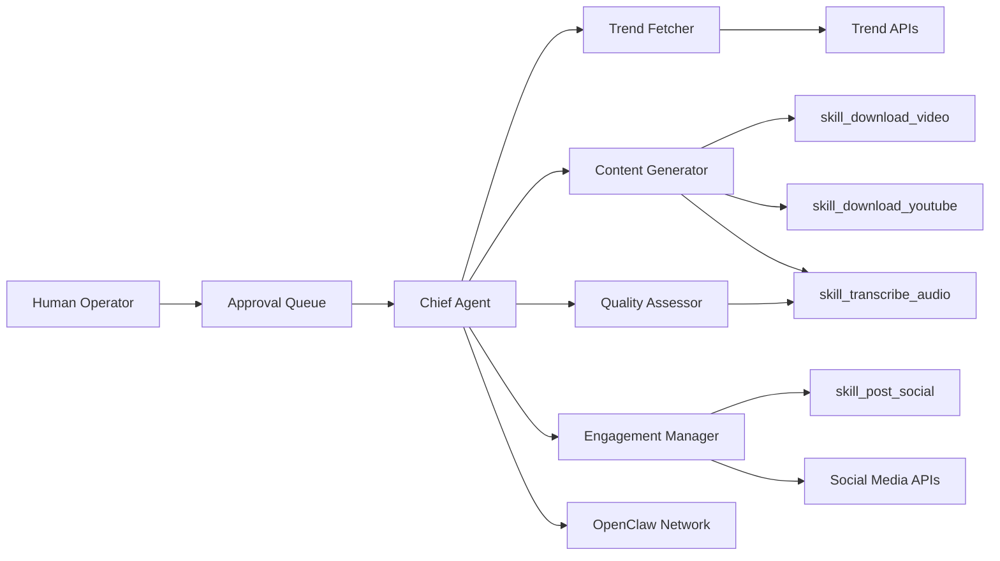
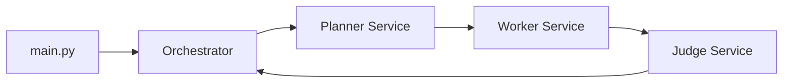
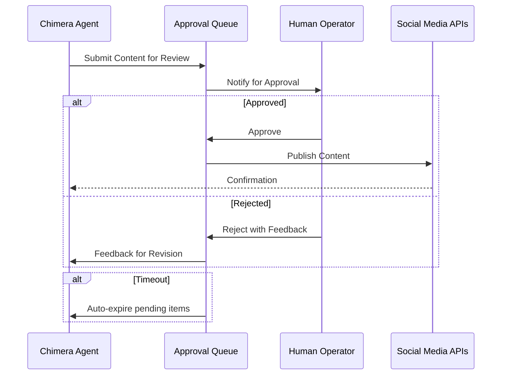
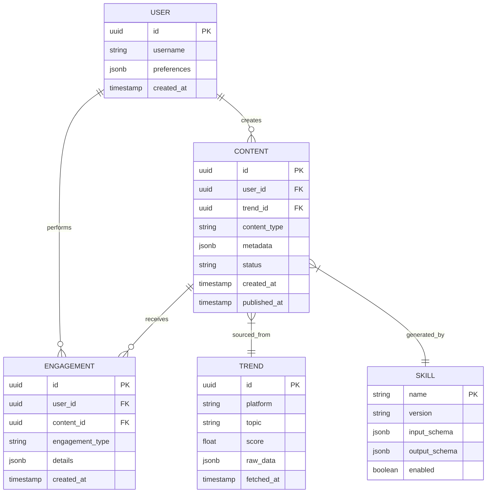
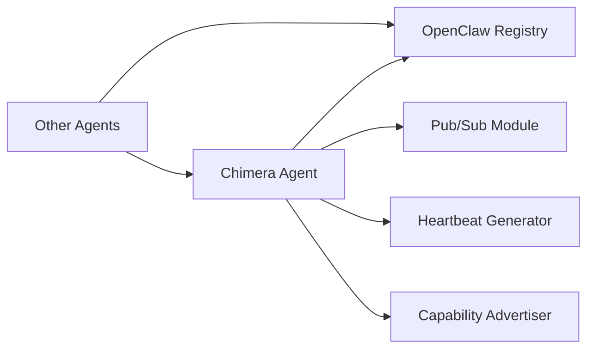
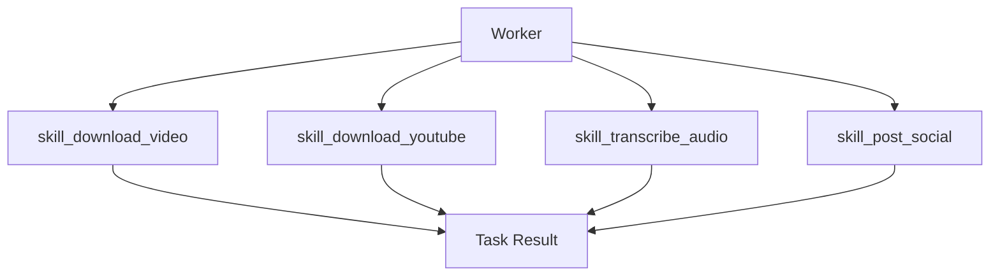
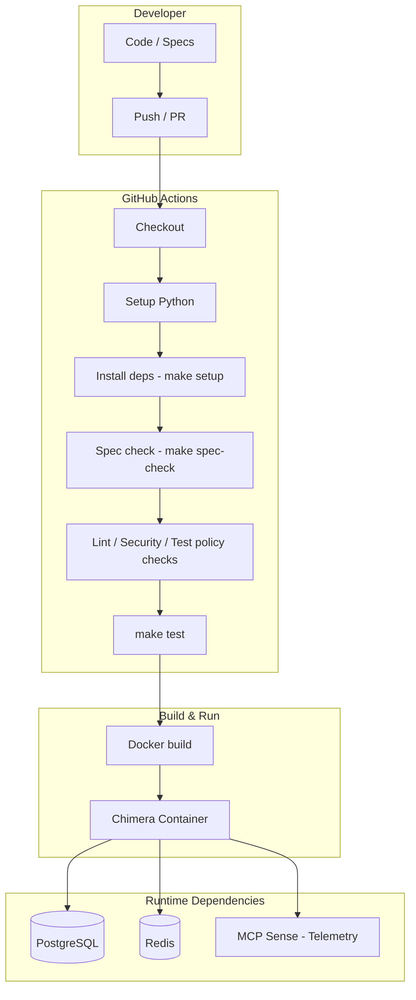

# Project Chimera – Architecture Strategy (Paraphrased & Diagrammed)

**Version:** 1.0.0  
**Date:** February 4, 2025  
**Status:** Draft for Team Review

---

## 1. Overview

Project Chimera is an autonomous AI influencer system that researches trends, generates content, and engages audiences with minimal human oversight.

**Key principles:**

- **Spec-Driven Development (SDD)** – All code is anchored in formal specifications.
- **Agentic Orchestration** – Planner, Worker, Judge agents have clearly defined roles.
- **Robust Infrastructure** – Scalable, traceable, and fault-tolerant.

---

## 2. Agent Architecture Approach

### 2.1 Evaluated Patterns (Textual)

| Pattern                | Score  | Notes                                                                 |
| ---------------------- | ------ | --------------------------------------------------------------------- |
| **Hierarchical Swarm** | 9/10   | Central Chief Agent manages sub-agents. Clear authority, scalable, fault-isolated. Single point of failure risk. |
| **Sequential Chain**  | 4/10   | Linear processing pipeline. Simple, predictable, but brittle.         |
| **Mesh Network**       | 7/10   | Peer-to-peer agent collaboration. Resilient but coordination-heavy. |
| **Actor Model**       | 8/10   | Asynchronous message-passing. High concurrency, complex debugging.   |

**Decision:** Core **Hierarchical Swarm** with **Mesh fallback**.

### 2.2 Conceptual Agent Structure

### 2.3 Runtime Flow (Orchestrator Cycle)

- **Planner:** Creates tasks with goal, priority, and acceptance criteria.
- **Worker:** Executes tasks using skills and returns results.
- **Judge:** Reviews results → approves, escalates, or rejects.

---

## 3. Human-in-the-Loop (HITL) Safety

---

## 4. Database Strategy

**Hybrid Architecture:** PostgreSQL + Redis + Elasticsearch

---

## 5. Agent Communication Protocols

---

## 6. Skill Layer Interaction

---

## 7. Infrastructure Overview

| Component        | Technology                          | Purpose                    |
| ---------------- | ----------------------------------- | -------------------------- |
| **Runtime**      | Python 3.11+                        | Agent logic                |
| **Dependencies** | uv                                  | Dependency management      |
| **Containers**   | Docker                              | Reproducible environment   |
| **Data**         | PostgreSQL + Redis + Elasticsearch | Storage & caching          |
| **CI/CD**        | GitHub Actions                      | Automation & testing       |
| **Telemetry**    | MCP Sense                           | Logging & auditing         |

**Directory structure (narrative):**

- `main.py` – Entrypoint
- `orchestrator/` – Chief Agent
- `services/` – Sub-agents (Planner, Worker, Judge)
- `skills/` – Invokable agent abilities
- `specs/` – Spec-driven documentation
- `agents/` – Governance & personas
- `schemas/` – Shared JSON schemas
- `policies/` – Sensitive content & disclosure rules
- `tests/` – Unit tests

---

## 8. Deployment & CI/CD Flow

- **CI:** On push/PR to `main`, run checkout → Python setup → `make setup` → `make spec-check` → quality policy checks → `make test`.
- **Build:** Docker image builds from passing CI.
- **Runtime:** Container connects to PostgreSQL, Redis, and MCP Sense for persistence, cache, and telemetry.

---

## 9. Next Steps

1. Stakeholder approval of architecture.
2. Define detailed API contracts (`specs/technical.md`).
3. Build Chief Agent skeleton using hierarchical swarm pattern.
4. Set up Docker + PostgreSQL dev environment.
5. Connect MCP Sense telemetry for logging and auditing.

---

## 10. References

- **a16z:** The Trillion Dollar AI Code Stack
- **OpenClaw:** Agent social networking framework
- **MoltBook:** Social media for bots
- **Project Chimera SRS**

---

_Document Version: 1.0.0_  
_Last Updated: February 4, 2025_  
_Next Review: February 6, 2025_
