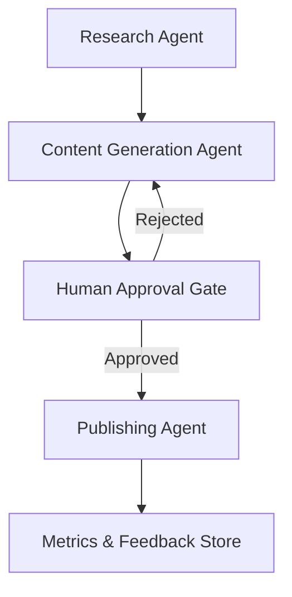
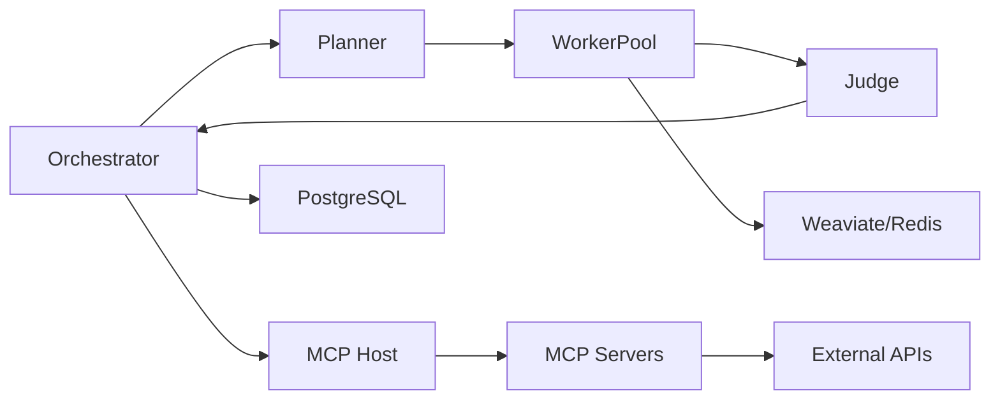

# Architecture Strategy — Project Chimera

## 1. Introduction

Project Chimera aims to build a **factory for Autonomous AI Influencers**—digital agents capable of researching trends, generating content, and managing engagement with minimal human intervention.

This document defines the **architectural strategy** for Project Chimera before any implementation begins. The goal is to ensure the system is **scalable, governable, observable, and safe**, especially in an environment where multiple AI agents collaborate.

This strategy follows the principles of:
- Spec-Driven Development (SDD)
- Agentic Orchestration
- Traceability and Governance via MCP Sense

---

## 2. Architectural Goals

The architecture of Project Chimera is designed to:

- Prevent fragile prompt-based systems
- Support multiple autonomous agents working together
- Enable human oversight at critical safety points
- Ensure reproducibility and auditability of agent behavior
- Scale content production without sacrificing control

---

## 3. Agent Pattern Selection

### Selected Pattern: Hierarchical Swarm

#### Rationale

The **Hierarchical Swarm** pattern is best suited for Project Chimera because:

- Content creation involves multiple specialized tasks (research, scripting, publishing)
- Agents must operate semi-independently while aligning with shared goals
- A central authority is required to enforce rules, specs, and safety constraints

This pattern mirrors real-world creative organizations where specialists perform focused work under a coordinating authority.

---

### Agent Roles (Conceptual)

- **Governor Agent**
  - Enforces specifications
  - Coordinates execution
  - Resolves conflicts between agents

- **Research Agent**
  - Identifies trends
  - Collects platform insights
  - Produces structured research outputs

- **Content Generation Agent**
  - Creates scripts, captions, and creative assets
  - Operates strictly within approved specifications

- **Publishing Agent**
  - Handles posting workflows
  - Interfaces with social platforms
  - Reports engagement metrics

---

### Agent Interaction Flow

---

## 4. Human-in-the-Loop (HITL) Placement

HITL occurs **after content generation and before publishing**. The Judge validates output for policy, confidence, and sensitive topics. Only approved outputs are published. Escalation is mandatory for low confidence or sensitive topics.

---

## 5. Data Storage Strategy

### Video Metadata (High-Velocity)
- **Primary Choice:** PostgreSQL for transactional integrity and queryability.
- **Rationale:** Supports multi-tenant data isolation, analytics, and strong constraints.

### Semantic Memory
- **Weaviate** for vector search over personas, memories, and context snippets.

### Short-Term Cache and Queues
- **Redis** for task queues and short-term memory windows.

---

## 6. MCP Integration Strategy

All external APIs are accessed via MCP servers:
- Social publishing (Twitter, Instagram, Threads)
- Knowledge sources (news, trends)
- Commerce (Coinbase AgentKit)

This decouples agent logic from external API volatility and centralizes governance.

---

## 7. Governance and Safety

- All agents adhere to `agents/AGENTS.md` and persona constraints in `agents/personas/SOUL.md`.
- Judge enforces policy, confidence thresholds, and sensitive-topic filters.
- All tool usage is logged via MCP Sense for traceability.

---

## 8. Architecture Diagram (System View)

