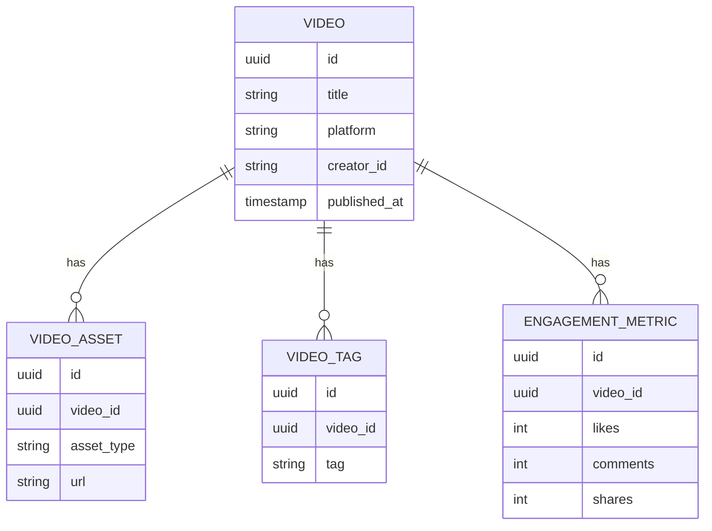

# Technical Specs
Purpose: Define system constraints, integrations, and non-functional requirements.

## Architecture Constraints
- Hub-and-Spoke topology with Central Orchestrator as control plane.
- Planner, Worker, and Judge run as decoupled services.
- MCP is the exclusive interface for external tools and resources.

## Data Stores
- Semantic memory: Weaviate
- Transactional data: PostgreSQL
- Short-term cache and queues: Redis

## Non-Functional Requirements
- Scalability: support at least 1,000 concurrent agents.
- Latency: high-priority interactions within 10 seconds excluding HITL.
- Compliance: AI disclosure when asked; sensitive topics route to HITL.

## API Contracts (Agent Task)
```json
{
  "task_id": "uuid-v4-string",
  "task_type": "generate_content | reply_comment | execute_transaction",
  "priority": "high | medium | low",
  "context": {
    "goal_description": "string",
    "persona_constraints": ["string"],
    "required_resources": ["mcp://twitter/mentions/123"]
  },
  "assigned_worker_id": "string",
  "created_at": "timestamp",
  "status": "pending | in_progress | review | complete"
}
```

## Database Schema (Video Metadata)

